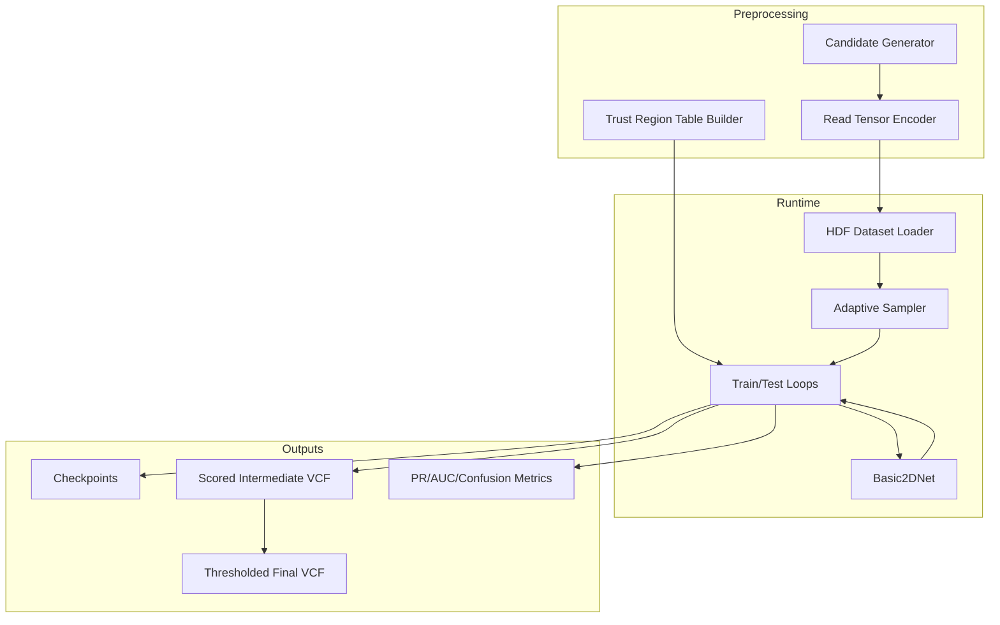
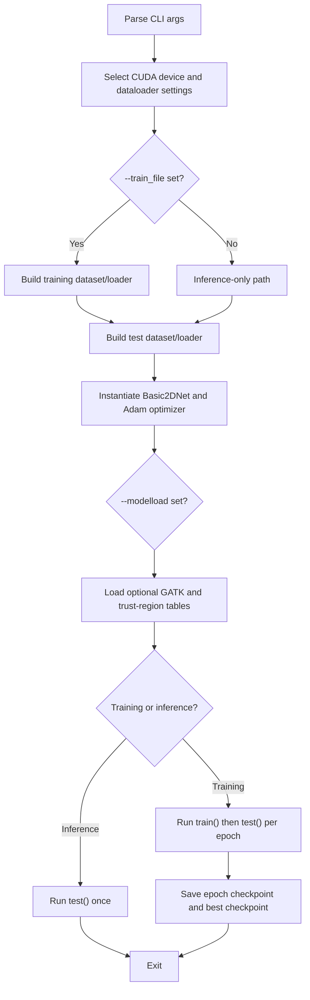

# Architecture

## Purpose

DL4VC implements a candidate-based variant caller for short-read germline sequencing. The system does not call directly from raw BAM positions end to end. Instead, it splits the problem into:

1. High-recall candidate generation.
2. Tensorization of local read context around each candidate.
3. Neural scoring of candidate truth and zygosity.
4. VCF post-processing and thresholding.

This separation is visible throughout the repository structure and command-line entry points.

## Repository Structure

| Path | Role |
| --- | --- |
| [main.py](/Users/nidhibharani/Developer/github_projects/DL4VC/main.py) | Primary training and inference entry point |
| [arguments.py](/Users/nidhibharani/Developer/github_projects/DL4VC/arguments.py) | Central CLI argument definition for `main.py` |
| [dl4vc/model.py](/Users/nidhibharani/Developer/github_projects/DL4VC/dl4vc/model.py) | `Basic2DNet` model definition |
| [dl4vc/dataset.py](/Users/nidhibharani/Developer/github_projects/DL4VC/dl4vc/dataset.py) | HDF-backed dataset loading, augmentation, and adaptive sampling |
| [dl4vc/trainer.py](/Users/nidhibharani/Developer/github_projects/DL4VC/dl4vc/trainer.py) | Training and evaluation loops |
| [dl4vc/objectives.py](/Users/nidhibharani/Developer/github_projects/DL4VC/dl4vc/objectives.py) | Soft BCE and focal-loss variants |
| [dl4vc/utils.py](/Users/nidhibharani/Developer/github_projects/DL4VC/dl4vc/utils.py) | VCF record helpers and checkpoint writing |
| [dl4vc/base_enum.py](/Users/nidhibharani/Developer/github_projects/DL4VC/dl4vc/base_enum.py) | Base and strand enum definitions |
| [tools/candidate_generator.py](/Users/nidhibharani/Developer/github_projects/DL4VC/tools/candidate_generator.py) | BAM-to-candidate VCF generation |
| [tools/convert_bam_single_reads.py](/Users/nidhibharani/Developer/github_projects/DL4VC/tools/convert_bam_single_reads.py) | BAM plus VCF to HDF tensor conversion |
| [tools/format_vcf.py](/Users/nidhibharani/Developer/github_projects/DL4VC/tools/format_vcf.py) | Thresholding and multi-allele post-processing |
| [call_variants.sh](/Users/nidhibharani/Developer/github_projects/DL4VC/call_variants.sh) | End-to-end inference wrapper |
| [train_variant_caller.sh](/Users/nidhibharani/Developer/github_projects/DL4VC/train_variant_caller.sh) | Training wrapper with curated hyperparameters |
| [docs/](/Users/nidhibharani/Developer/github_projects/DL4VC/docs) | User and developer documentation |

## High-Level Component Layout

## Execution Modes

### 1. Training plus evaluation

`main.py` enters training mode when `--train_file` is provided. In that mode it:

1. Opens a training HDF dataset.
2. Opens a test HDF dataset.
3. Builds `Basic2DNet`.
4. Trains for `--epochs`.
5. Evaluates after each epoch unless skipped.
6. Writes per-epoch checkpoints and optionally per-epoch VCF outputs.

### 2. Inference only

`main.py` enters inference-only mode when `--train_file` is omitted and `--test_file` plus `--modelload` are provided. This is the mode used by [call_variants.sh](/Users/nidhibharani/Developer/github_projects/DL4VC/call_variants.sh).

## Control Flow In `main.py`

## Design Choices Reflected In Code

### Candidate-first architecture

The model never scans the entire BAM directly. `tools/candidate_generator.py` reduces the search space first, trading precision for recall. The deep model then acts as a candidate classifier and zygosity estimator.

### Read-centric tensor representation

The learning problem is formulated around a fixed window centered on each candidate and a fixed maximum number of reads sampled from the local pileup. This lets the model operate with dense tensors and standard PyTorch batching.

### Non-standard but pragmatic VCF staging

The repository uses a scored intermediate VCF as an internal transport format between inference and `tools/format_vcf.py`. The score payload is not written into a standard INFO field, so that file should be treated as a pipeline artifact rather than a final external interface.

### Adaptive sampling of easy examples

The dataset loader and sampler collaborate with the training loop. After each epoch, examples close to the predicted label can be marked as "close" and partially downsampled in later epochs. This acts like a lightweight curriculum or hard-example mining pass.

## Architectural Constraints And Caveats

| Constraint | Impact |
| --- | --- |
| `arguments.py` marks `--test_file` as required | Even training runs must provide an evaluation dataset |
| `main.py` wraps the model in `nn.DataParallel(...).cuda()` | GPU execution is effectively mandatory |
| `ContextDatasetFromNumpy` reads from a single HDF dataset named `data` | Other HDF layouts are unsupported without code changes |
| `process_locations_chunk()` asserts quality-score and strand output | HDF generation currently expects those channels to be present |
| Several utility scripts are research-era helpers | Not every script participates in the supported end-to-end workflow |

## Files That Look Important But Are Mostly Historical

| File | Status |
| --- | --- |
| [cnn_single_read_simple.py](/Users/nidhibharani/Developer/github_projects/DL4VC/cnn_single_read_simple.py) | Older experimental example, not the main production path |
| [split_training_data.py](/Users/nidhibharani/Developer/github_projects/DL4VC/split_training_data.py) | Legacy text-dataset splitter from an earlier data format |

## Where To Make Changes

| If you want to change... | Start here |
| --- | --- |
| Candidate recall and allele proposal logic | [tools/candidate_generator.py](/Users/nidhibharani/Developer/github_projects/DL4VC/tools/candidate_generator.py) |
| Read tensor encoding and HDF serialization | [tools/convert_bam_single_reads.py](/Users/nidhibharani/Developer/github_projects/DL4VC/tools/convert_bam_single_reads.py) |
| Training batch semantics or active sampling | [dl4vc/dataset.py](/Users/nidhibharani/Developer/github_projects/DL4VC/dl4vc/dataset.py), [dl4vc/trainer.py](/Users/nidhibharani/Developer/github_projects/DL4VC/dl4vc/trainer.py) |
| Network architecture or auxiliary heads | [dl4vc/model.py](/Users/nidhibharani/Developer/github_projects/DL4VC/dl4vc/model.py) |
| Thresholding and genotype output logic | [tools/format_vcf.py](/Users/nidhibharani/Developer/github_projects/DL4VC/tools/format_vcf.py) |
