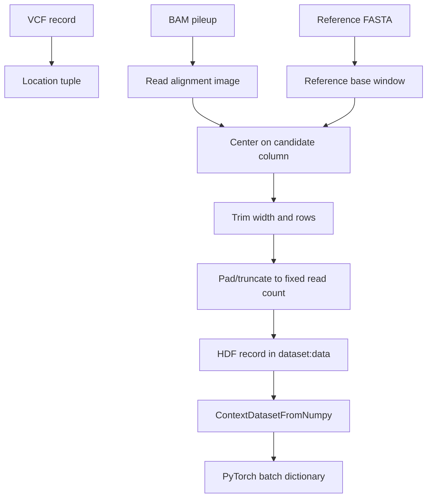

# Data Formats

## Overview

DL4VC moves data through three main representations:

1. Candidate or truth VCF records.
2. HDF-stored fixed-shape tensors per candidate locus.
3. In-memory batch dictionaries returned by `ContextDatasetFromNumpy`.

Understanding these formats is necessary before changing preprocessing, augmentation, or model inputs.

## Base And Strand Enums

The project stores bases as integer enums defined in [dl4vc/base_enum.py](/Users/nidhibharani/Developer/github_projects/DL4VC/dl4vc/base_enum.py).

### Base enum

| Token | Value | Meaning |
| --- | --- | --- |
| `pad` | `0` | Padding / empty cell |
| `A` | `1` | Adenine |
| `T` or `U` | `2` | Thymine / Uracil |
| `G` | `3` | Guanine |
| `C` | `4` | Cytosine |
| `-` / empty / `N` | `5` | Gap-like or unknown alignment symbol |
| `start` | `6` | Start marker |
| `end` | `7` | End marker |
| `noinsert` | `8` | Special insert sentinel |
| `?` / ambiguous bases | `9` | Unknown / ambiguous |

### Strand enum

| Token | Value | Meaning |
| --- | --- | --- |
| `0` | `STRAND_PAD` | No strand value / padding |
| `1` | `STRAND_LOWER` | Lowercase read base in encoded pileup |
| `2` | `STRAND_UPPER` | Uppercase read base in encoded pileup |

## Variant Labels

The supervised label semantics are unusual and worth documenting explicitly.

| Label stored in dataset | Meaning | Binary target in training |
| --- | --- | --- |
| `0` | True positive variant candidate | Positive |
| `1` | False negative truth-site example | Positive |
| `2` | False positive candidate | Negative |

The binary target is derived as `target <= 1`, so labels `0` and `1` both represent "mutation present".

The model also learns a separate variant-type target:

| Variant type target | Meaning |
| --- | --- |
| `0` | No variant |
| `1` | Heterozygous variant |
| `2` | Homozygous variant |

## VCF Expectations

### Candidate or truth VCFs

The parsing code in [dl4vc/utils.py](/Users/nidhibharani/Developer/github_projects/DL4VC/dl4vc/utils.py) expects:

- Standard VCF tab-separated columns.
- `REF` in column 4 and `ALT` in column 5.
- `INFO` field containing `AF=<float>` and `DP=<int>`.
- Optional sample/genotype information that can distinguish `0/1` from `1/1`.

### Parsed VCF-derived fields

`parse_vcf()` derives:

- `is_snp`
- `var_mode` as SNP, insert, or delete
- `ref_base`
- `var_base`
- `allele_freq`
- `coverage`
- `var_type`

### Intermediate inference VCF

During inference, `append_vcf_records()` inserts a score string like:

```text
BP=0.99320000;NV=0.00210000;HV=0.74400000;OV=0.25390000
```

into the third VCF column. This file is only intended for consumption by `tools/format_vcf.py`.

## HDF Dataset Layout

`tools/convert_bam_single_reads.py` writes a gzip-compressed HDF file with a single dataset named `data`.

The dataset dtype is assembled dynamically and currently includes:

| Field | Type | Shape | Meaning |
| --- | --- | --- | --- |
| `name` | string | scalar | Locus identifier |
| `ref` | `uint8` | `(5, TOTAL_COLUMNS)` | Older multi-channel reference image |
| `reads` | `uint16` | `(5, TOTAL_COLUMNS)` | Older multi-channel read image |
| `single_reads` | `uint8` | `(TOTAL_SINGLE_READS, TOTAL_COLUMNS)` | Primary per-read tensor used downstream |
| `ref_bases` | `uint8` | `(TOTAL_COLUMNS,)` | Reference base sequence for the centered window |
| `num_reads` | `int32` | scalar | Number of real reads before padding |
| `label` | `uint8` | scalar | Supervised label |
| `vcfrec` | string | scalar | Original VCF record text |
| `q-scores` | `uint8` | `(TOTAL_SINGLE_READS, TOTAL_COLUMNS)` | Base-quality channel |
| `strand` | `uint8` | `(TOTAL_SINGLE_READS, TOTAL_COLUMNS)` | Strand channel |

Where:

- `TOTAL_COLUMNS = 2 * window_size + 1`
- Default `window_size = 100`, so the default sequence width is `201`
- `TOTAL_SINGLE_READS = args.max_reads` at HDF creation time

## HDF Example Lifecycle



## In-Memory Dataset Item Structure

`ContextDatasetFromNumpy._get_generator()` yields a dictionary containing:

| Key | Meaning |
| --- | --- |
| `name` | Locus identifier |
| `label` | Supervised class label |
| `ref` | Reference base vector of length 201 |
| `reads` | Sampled read matrix shaped as `(read_length, max_reads)` before collation |
| `vcfrec` | Raw VCF text |
| `q-scores` | Quality-score matrix aligned with `reads` |
| `strands` | Strand matrix aligned with `reads` |
| `num_reads` | Read count before padding |
| `is_snp` | Boolean SNP indicator |
| `var_type` | No-variant / heterozygous / homozygous target |
| `allele_freq` | Either candidate AF or recomputed AF from sampled reads |
| `coverage` | Coverage estimate at the centered position |
| `var_base_enum` | Enum class for ALT base or indel marker |
| `var_ref_enum` | Enum class for REF base |
| `var_base_vector` | Padded ALT allele sequence vector |
| `var_ref_vector` | Padded REF allele sequence vector |
| `var_mask` | Position-wise read mask for variant matching |
| `ref_mask` | Position-wise read mask for reference matching |
| `idx` | Example index inside HDF |
| `blacklist` | Whether mask generation failed for this example |

## Shape Conventions

### On disk

- `single_reads` is stored as `(num_reads, read_length)`.

### In the dataset loader

- Stored reads are transposed to `(read_length, stored_read_count)`.
- A subset of reads is sampled to `max_reads`.
- Quality scores and strand matrices are sampled using the same permutation.

### In the model

The batch is embedded and rearranged into a conv-friendly format approximating:

- batch
- sequence length
- read index
- embedding or side-channel dimension

The exact tensor juggling happens in [dl4vc/model.py](/Users/nidhibharani/Developer/github_projects/DL4VC/dl4vc/model.py), but the model fundamentally expects a 201-position window over a bounded set of reads.

## Sampling And Augmentation Rules

`ContextDatasetFromNumpy` performs several transformations before a sample reaches the model:

- Samples at most `MAX_READS` reads from the stored pileup.
- Optionally random-samples rather than taking a middle slice.
- Optionally adds synthetic base noise to reads.
- Optionally masks parts of the reference sequence with unknowns.
- Optionally down-samples reads dynamically for regularization.
- Optionally recomputes allele frequency from the sampled reads.

## Mask Semantics

The model can consume per-position masks that encode whether a read matches:

- the proposed reference allele
- the proposed alternate allele
- the variant length footprint

These masks are built by `get_read_mask_vectors()` and are especially important for distinguishing alleles in multi-allelic settings.

## Center Position Convention

The code assumes the candidate locus is centered in the window. With the default `window_size=100`:

- Index `100` is the conceptual center.
- SNP logic usually reads from the center base.
- Insert/delete handling can inspect neighboring columns because inserts are represented with padding/gap conventions.

This convention is hard-coded in multiple places, including read counting and mask generation.

## Data Format Caveats

| Caveat | Consequence |
| --- | --- |
| Several functions assume read length `201` | Changing window size requires auditing many downstream assumptions |
| Insertions and deletions are represented with padding conventions | Long or unusual indels are more fragile than SNPs |
| Multi-allelic support exists but is partly heuristic | Candidate AF retention and mask logic are important for those cases |
| Failed mask generation blacklists an example | Some data issues are silently converted into skip behavior later |
