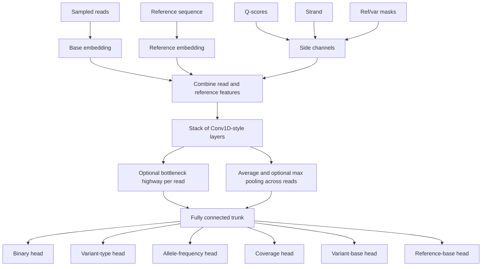
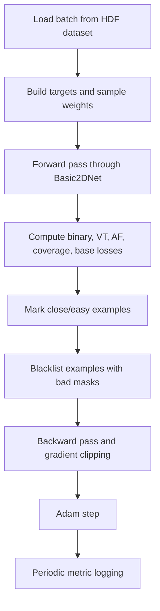

# Model And Training

## Model Summary

The main network is `Basic2DNet` in [dl4vc/model.py](/Users/nidhibharani/Developer/github_projects/DL4VC/dl4vc/model.py). Despite the name, the current supported path is a read-centric 1D convolutional architecture implemented with `Conv2d` layers whose kernels slide across sequence positions while preserving a separate read dimension until pooling.

The model predicts:

- binary mutation presence
- variant type and zygosity
- allele frequency
- coverage
- variant base class
- reference base class

## Input Features

The forward pass consumes:

- embedded read bases
- embedded reference bases
- optional quality scores
- optional strand channels
- optional read/reference and read/variant match masks
- optional per-example allele frequency side information

The production wrappers enable:

- quality scores
- strand channels
- read/ref/variant masking
- bottleneck highway read features
- residual convolutions late in the stack

## Model Topology

## Detailed Architecture Notes

### Embedding layer

Base tokens are mapped through a learnable embedding table. Positional encodings are then added so the model can distinguish the center locus from flanking context.

### Read/reference composition

The dominant path expands the reference to match the per-read tensor and concatenates it channel-wise with the read embeddings. This preserves per-read independence early and lets the network compare each read against the reference locally.

### Convolution stack

The model creates a configurable number of `Conv2d` layers with kernel shape `(1, kernel_width)`. In effect:

- no convolution happens across the read axis
- convolution happens across sequence positions within each read
- cross-read aggregation is postponed to pooling layers

This is a core design decision of the repository.

### Intermediate read pooling

Selected layers can inject average-pooled cross-read summaries back into later layers. This allows the network to combine per-read evidence with aggregate evidence before the final pooling stage.

### Highway bottleneck features

Each convolution stage can emit a compressed per-read representation through a 1x1 bottleneck followed by a full-width compression layer. These per-read summaries are concatenated into the fully connected trunk.

### Output heads

The final hidden representation fans out into:

- a 2-class binary head
- a 3-class variant-type head
- regression-style heads for AF and coverage
- categorical heads for ALT base and REF base

## Supported And Deprecated Options

The code exposes many historical switches. The active path matters more than the surface area of the CLI.

### Actively used in wrappers

- `--model-use-q-scores`
- `--model-use-strands`
- `--model-use-reads-ref-var-mask`
- `--model-conv-layers`
- `--model-residual-layer-start`
- `--model-ave-pool-layers`
- `--model-init-conv-channels`
- `--model-final-conv-channels`
- `--model-bottleneck-size`
- `--model_concat_hw_reads`
- `--model-highway-single-reads`
- `--model_final_layer_dilation`
- `--model_middle_layer_dilation`

### Present but effectively deprecated in code

- `append_num_reads`
- `append_trust_region`
- `append_AF` without naive-variant encoding
- `use_naive_variant_encoding`
- non-Conv1D runtime path

The constructor contains explicit assertions for several deprecated branches.

## Training Targets And Losses

The training loop in [dl4vc/trainer.py](/Users/nidhibharani/Developer/github_projects/DL4VC/dl4vc/trainer.py) optimizes a combined objective.

### Primary tasks

| Head | Loss family | Purpose |
| --- | --- | --- |
| Binary mutation head | Soft BCE / focal variant | Mutation vs no mutation |
| Variant-type head | Soft BCE / focal variant | No variant vs heterozygous vs homozygous |

### Auxiliary tasks

| Head | Loss |
| --- | --- |
| Allele frequency | `binary_cross_entropy` |
| Coverage | `mse_loss` |
| Variant base | `cross_entropy` |
| Reference base | `cross_entropy` |

### Label smoothing

The custom `SoftBCEWithLogitsLoss` and `SoftBCEWithLogitsFocalLoss` build smoothed one-hot targets and also return a "close match" flag used for adaptive downsampling of easy examples.

### Focal loss

If `--focal_loss_gamma > 0`, the code uses the focal-loss variant to emphasize harder examples. The wrappers enable this path with `gamma=0.2`.

## Training Loop Behavior

## Adaptive Sampling

The project includes a notable training optimization.

### Close-example tracking

Each example can be marked as a "close match" if the model prediction is sufficiently near the smoothed target distribution. Those examples are tracked in `train_dataset.close_examples`.

### Adjustable sampler

`AdjustableDataSampler` then:

- always keeps non-close examples
- keeps only a configurable fraction of close examples
- excludes blacklisted examples
- optionally enforces chromosome holdouts

This reduces training time on easy cases while keeping hard examples in circulation.

## Epoch-Level Evaluation

`test()` performs more than a simple loss calculation. It also:

- converts binary logits into mutation probabilities
- builds precision/recall and ROC curves
- chooses the threshold that maximizes F1 on the evaluation set
- prints confusion matrices
- optionally compares against a precomputed GATK lookup table
- optionally streams scored VCF records to disk

## Checkpointing

`save_checkpoint()` writes:

- `basename_epochN.ext` every epoch
- `basename_best.ext` whenever a new best loss is found

The saved state contains:

- epoch number
- `state_dict`
- best loss so far
- optimizer state

## Practical Training Notes

| Behavior | Implication |
| --- | --- |
| Model is wrapped with `nn.DataParallel` | Batch size is interpreted per GPU in wrapper comments |
| HDF datasets are lazily read | Training startup is fast even for large datasets |
| `torch.cuda.empty_cache()` is called after evaluation | The code anticipates memory growth during test-time inference |
| Some directional augmentation code is present but disabled | Not every CLI flag reflects an actively maintained feature |

## Known Implementation Constraints

### GPU-only in practice

`main.py` selects a CUDA device conditionally but still constructs the model with `.cuda()`. Document and plan around GPU execution.

### Fixed-width assumptions

Several pieces of logic assume:

- sequence width `201`
- centered position `100`
- sampled read count bounded by `MAX_READS`

Changing these values requires auditing the dataset, masks, and model code together.

### Intermediate outputs are operational, not clean abstractions

The model predicts many auxiliary targets because the repository doubles as a research codebase. Those outputs help training but also increase coupling between the model, dataset parser, and trainer.
