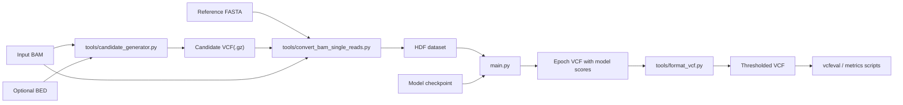

# DL4VC Documentation

This directory contains implementation-focused documentation for the DL4VC codebase.

## Reading Map

| Document | Purpose |
| --- | --- |
| [Architecture.md](/Users/nidhibharani/Developer/github_projects/DL4VC/docs/Architecture.md) | Repository structure, component boundaries, and end-to-end system layout |
| [Workflows.md](/Users/nidhibharani/Developer/github_projects/DL4VC/docs/Workflows.md) | Training, inference, and evaluation procedures with concrete artifact flow |
| [Data-Formats.md](/Users/nidhibharani/Developer/github_projects/DL4VC/docs/Data-Formats.md) | HDF schema, tensor semantics, labels, enums, and VCF conventions |
| [Model-and-Training.md](/Users/nidhibharani/Developer/github_projects/DL4VC/docs/Model-and-Training.md) | Neural network architecture, loss functions, and training loop behavior |
| [Utilities-and-Scripts.md](/Users/nidhibharani/Developer/github_projects/DL4VC/docs/Utilities-and-Scripts.md) | Purpose and usage of wrapper scripts and helper utilities |
| [Step-by-step.md](/Users/nidhibharani/Developer/github_projects/DL4VC/docs/Step-by-step.md) | Original short workflow notes kept for historical reference |
| [Data.md](/Users/nidhibharani/Developer/github_projects/DL4VC/docs/Data.md) | Original dataset download notes kept for historical reference |

## What This Project Does

DL4VC is a germline short-read variant caller built around a PyTorch model that scores candidate variants from pileup-like read tensors. The repository covers the full pipeline:

1. Generate high-recall candidate variants from a BAM.
2. Convert candidate loci plus aligned reads into a fixed-shape HDF dataset.
3. Train or run inference with a read-centric convolutional model.
4. Post-process model scores into a thresholded, multi-allele-aware VCF.

## System At A Glance

## Important Operational Notes

- The code is organized around a GPU training and inference path. Although `main.py` exposes `--no-cuda`, the current model construction still calls `.cuda()` unconditionally, so CPU-only execution is not a supported path in practice.
- The primary training and inference data format is a gzip-compressed HDF file with a single dataset named `data`.
- `convert_bam_single_reads.py` currently serializes datasets with both quality scores and strand channels, and downstream code assumes those fields exist.
- The intermediate VCF emitted during inference is not a standards-compliant final VCF. Model scores are spliced into the third column and later consumed by `tools/format_vcf.py`.

## Recommended Order For New Contributors

1. Start with [Architecture.md](/Users/nidhibharani/Developer/github_projects/DL4VC/docs/Architecture.md).
2. Read [Workflows.md](/Users/nidhibharani/Developer/github_projects/DL4VC/docs/Workflows.md) for the operational pipeline.
3. Use [Data-Formats.md](/Users/nidhibharani/Developer/github_projects/DL4VC/docs/Data-Formats.md) and [Model-and-Training.md](/Users/nidhibharani/Developer/github_projects/DL4VC/docs/Model-and-Training.md) when changing internals.
4. Use [Utilities-and-Scripts.md](/Users/nidhibharani/Developer/github_projects/DL4VC/docs/Utilities-and-Scripts.md) when working with wrappers or maintenance scripts.
