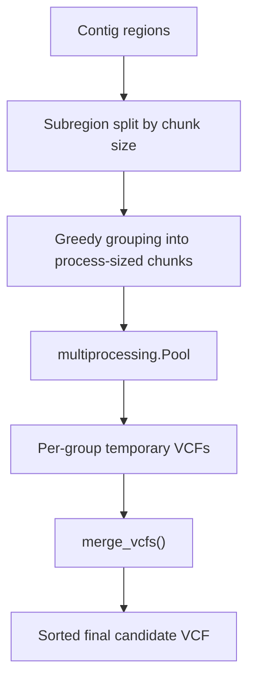

# Utilities And Scripts

## Entry Points

### Top-level wrappers

| Script | Purpose |
| --- | --- |
| [call_variants.sh](/Users/nidhibharani/Developer/github_projects/DL4VC/call_variants.sh) | End-to-end inference from BAM to compressed final VCF |
| [train_variant_caller.sh](/Users/nidhibharani/Developer/github_projects/DL4VC/train_variant_caller.sh) | Opinionated training wrapper around `main.py` |
| [main.py](/Users/nidhibharani/Developer/github_projects/DL4VC/main.py) | Core runtime for both training and inference |

### Utility scripts

| Script | Category | Purpose |
| --- | --- | --- |
| [tools/candidate_generator.py](/Users/nidhibharani/Developer/github_projects/DL4VC/tools/candidate_generator.py) | Preprocessing | Generate candidate VCFs from BAM data |
| [tools/convert_bam_single_reads.py](/Users/nidhibharani/Developer/github_projects/DL4VC/tools/convert_bam_single_reads.py) | Preprocessing | Convert candidate loci into HDF read tensors |
| [tools/format_vcf.py](/Users/nidhibharani/Developer/github_projects/DL4VC/tools/format_vcf.py) | Post-processing | Threshold scored VCFs and assign genotypes |
| [tools/combine_h5_dataset.py](/Users/nidhibharani/Developer/github_projects/DL4VC/tools/combine_h5_dataset.py) | Data maintenance | Append one HDF dataset into another |
| [tools/called_variant_metrics.py](/Users/nidhibharani/Developer/github_projects/DL4VC/tools/called_variant_metrics.py) | Evaluation | Precision/recall counts for SNPs and indels |
| [make_trust_region_filter.py](/Users/nidhibharani/Developer/github_projects/DL4VC/make_trust_region_filter.py) | Evaluation | Convert BED intervals into a pickled trust-region lookup table |
| [make_vcf_table.py](/Users/nidhibharani/Developer/github_projects/DL4VC/make_vcf_table.py) | Evaluation/debug | Build a pickled lookup table from a GATK VCF |
| [split_training_data.py](/Users/nidhibharani/Developer/github_projects/DL4VC/split_training_data.py) | Legacy data prep | Split an older text dataset format into train/val/test |
| [tools/bedutils.py](/Users/nidhibharani/Developer/github_projects/DL4VC/tools/bedutils.py) | Helper library | BED interval parsing and intersection |
| [tools/threshold.py](/Users/nidhibharani/Developer/github_projects/DL4VC/tools/threshold.py) | Helper library | Threshold utility helpers |
| [tools/canonical_vcf.py](/Users/nidhibharani/Developer/github_projects/DL4VC/tools/canonical_vcf.py) | Helper library | Canonicalize variant allele representation |
| [tools/find_alt_variants.py](/Users/nidhibharani/Developer/github_projects/DL4VC/tools/find_alt_variants.py) | Analysis/debug | Search and compare alternate variants |
| [tools/downsample_h5py_snippet.py](/Users/nidhibharani/Developer/github_projects/DL4VC/tools/downsample_h5py_snippet.py) | Snippet | Small helper for HDF experimentation |

## Wrapper Scripts

## `call_variants.sh`

This is the main operational wrapper for inference.

### Inputs

- `-i` BAM
- `-b` BED file
- `-m` pretrained checkpoint
- `-o` output directory
- `-r` reference FASTA

### Stages

1. Generate candidate VCF.
2. Encode candidates into HDF.
3. Run `main.py` in inference-only mode.
4. Sort the scored VCF.
5. Threshold and genotype the calls.
6. Normalize multiallelic records.
7. Compress and index the final VCF.

### Notable defaults

- SNP minimum allele fraction `0.075`
- Indel minimum allele fraction `0.02`
- HDF generation with `--max-reads 200`
- Inference batch size `200`

## `train_variant_caller.sh`

This is an opinionated launcher for model training.

### What it standardizes

- network depth and residual configuration
- focal loss setup
- auxiliary losses
- quality-score and strand channels
- easy-example downsampling
- checkpoint and VCF output paths

### When to bypass it

Use `main.py` directly when you need:

- different loss weights
- different data-loader settings
- debugging flags
- experiments with architectural options not covered by the wrapper

## Core Preprocessing Scripts

## `tools/candidate_generator.py`

### Core responsibilities

- Iterate aligned reads in target regions.
- Extract substitution, insertion, and deletion alleles from each read.
- Count locus coverage and allele support.
- Filter alleles by separate SNP and indel frequency thresholds.
- Optionally collapse multiallelic sites to the highest-AF allele.
- Emit and tabix-index a candidate VCF.

### Parallelization model

### Important options

| Option | Meaning |
| --- | --- |
| `--contigs` | Restrict to specific regions |
| `--bedfile` | Intersect work with confident regions |
| `--chunk_size` | Region size per parallel unit in kb |
| `--threads` | Worker-process count |
| `--keep_multialleles` | Keep multiple alleles at the same locus |
| `--max_len_indel_allele` | Ignore very long indels |

## `tools/convert_bam_single_reads.py`

### Core responsibilities

- Load candidate or truth loci from VCFs.
- Build pileup-style per-read matrices around each locus.
- Center the image on the candidate position.
- Pad or trim to fixed width and fixed max reads.
- Save HDF records in chunks for large datasets.

### Important options

| Option | Meaning |
| --- | --- |
| `--tp_vcf` | VCF containing positive examples |
| `--fp_vcf` | VCF containing negative examples or candidate examples for inference |
| `--fn_vcf` | Optional truth-only variant misses |
| `--fasta-input` | Reference FASTA |
| `--locations-process-step` | Chunk size for HDF append operations |
| `--num-processes` | Worker count |
| `--max-reads` | On-disk maximum number of reads per example |
| `--window-size` | Flanking context on each side of the locus |
| `--save-q-scores` | Required by the current downstream path |
| `--save-strand` | Required by the current downstream path |

## `tools/format_vcf.py`

### Core responsibilities

- Read the scored intermediate VCF.
- Compute a threshold score as `1 - NV`.
- Apply separate thresholds for SNPs, indels, long indels, and deletions.
- Convert scores into `0/1` or `1/1` genotype calls.
- Prune extra alleles at the same locus heuristically.

### Output expectation

This tool emits a VCF-like file that is intended to be closer to standards-compliant output than the raw scored file. The wrapper then normalizes multi-allelic records with `bcftools norm`.

## Evaluation And Maintenance Scripts

## `make_trust_region_filter.py`

Purpose:

- Convert a BED file into pickled per-chromosome interval lists.
- Support fast lookup with `is_in_region()`.

Used by:

- `main.py` and `trainer.py` for trust-region-aware reporting and weighting.

## `make_vcf_table.py`

Purpose:

- Build a compact lookup table from a GATK VCF.
- Support side-by-side metric comparison in the evaluation loop.

## `tools/called_variant_metrics.py`

Purpose:

- Intersect truth and called VCFs with `bcftools.isec`.
- Count SNPs, insertions, and deletions in TP/FP/FN buckets.
- Print simple precision and recall summaries.

## `tools/combine_h5_dataset.py`

Purpose:

- Append all rows from one HDF dataset into another in chunks.

When it is useful:

- combining separately encoded shards
- resuming long preprocessing runs into a single training file

## Legacy And Research Helpers

These are present in the repository but are not the center of the documented production path.

| File | Notes |
| --- | --- |
| [cnn_single_read_simple.py](/Users/nidhibharani/Developer/github_projects/DL4VC/cnn_single_read_simple.py) | Early simple example network |
| [split_training_data.py](/Users/nidhibharani/Developer/github_projects/DL4VC/split_training_data.py) | Works on an older text dataset format |
| [tools/find_alt_variants.py](/Users/nidhibharani/Developer/github_projects/DL4VC/tools/find_alt_variants.py) | Niche analysis/debugging helper |

## Suggested Usage Pattern

1. Use the wrappers for standard runs.
2. Use the Python tools directly when debugging a specific pipeline stage.
3. Treat older research helpers as reference material unless you verify they match the current HDF-based path.
