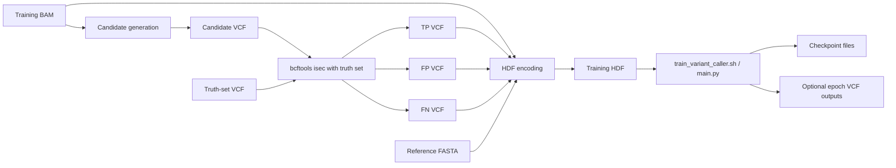
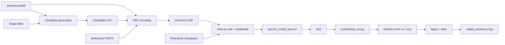

# Workflows

## Pipeline Overview

DL4VC has two primary user-facing workflows:

1. Train a model from a BAM, truth-set VCFs, and a reference FASTA.
2. Run inference on a BAM using a pretrained checkpoint.

The repository also includes evaluation and maintenance utilities around these flows.

## Artifact Flow

| Stage | Input | Output | Main Tool |
| --- | --- | --- | --- |
| Candidate proposal | BAM, optional BED | Candidate VCF | `tools/candidate_generator.py` |
| Tensor encoding | BAM, candidate/truth VCF, reference FASTA | HDF dataset | `tools/convert_bam_single_reads.py` |
| Model runtime | HDF dataset, checkpoint | Scored per-candidate VCF | `main.py` |
| Post-processing | Scored intermediate VCF | Thresholded final VCF | `tools/format_vcf.py`, `bcftools norm` |
| Evaluation | Final VCF plus truth VCF | Precision/recall style metrics | `rtg vcfeval`, `tools/called_variant_metrics.py` |

## Training Workflow



## Inference Workflow



## Common Requirements

### Python packages

The pinned dependencies in [requirements.txt](/Users/nidhibharani/Developer/github_projects/DL4VC/requirements.txt) are:

- `torch==1.2.0`
- `torchvision==0.3.0`
- `pysam==0.15.1`
- `h5py==2.9.0`
- `numpy==1.15.4`
- `pandas==0.23.4`
- `pytest==4.1.1`
- `tqdm==4.30.0`
- `sklearn==0.0`

### External tools

- `bcftools`
- `bgzip`
- `tabix`
- `rtg vcfeval` for benchmarking

### Runtime assumptions

- GPU availability is assumed by the current main execution path.
- BAM files should be indexed and readable by `pysam`.
- Candidate generation expects aligned reads with MD tags available for substitution detection.

## Training From Scratch

### Step 1. Generate candidate variants

This stage scans reads and emits a high-recall candidate VCF. SNPs and indels have separate minimum frequency thresholds.

Example:

```bash
python tools/candidate_generator.py \
  --input HG001-NA12878-50x.sort.bam \
  --output HG001-NA12878-50x-candidates.vcf \
  --snp_min_freq 0.075 \
  --indel_min_freq 0.02 \
  --keep_multialleles
```

What the code does:

- Reads the BAM with `pysam.AlignmentFile`.
- Splits requested regions into chunk-sized subregions.
- Parallelizes subregion processing with a multiprocessing pool.
- Detects substitution, insertion, and deletion alleles from per-read alignments.
- Computes depth and allele frequency per locus.
- Emits a VCF with `DP` and `AF` fields.

### Step 2. Intersect candidates with a truth set

The repository expects TP, FP, and optionally FN VCFs when building supervised examples.

Example:

```bash
bcftools isec \
  -p HG001-NA12878-50x \
  NA12878_GIAB_highconf_IllFB-IllGATKHC-CG-Ion-Solid_ALLCHROM_v3.2.2_highconf.bcf \
  HG001-NA12878-50x-candidates.vcf.gz
```

Typical outputs:

- `0000.vcf`: false negatives relative to truth
- `0001.vcf`: false positives
- `0002.vcf`: shared variants
- `0003.vcf`: truth-supporting candidate set used as TP input in the project docs

### Step 3. Convert loci into an HDF dataset

This is the most important preprocessing step. `tools/convert_bam_single_reads.py` creates fixed-shape examples around each candidate location.

Example:

```bash
python tools/convert_bam_single_reads.py \
  --input HG001-NA12878-50x.sort.bam \
  --tp_vcf HG001-NA12878-50x/0003.vcf \
  --tp_full_vcf HG001-NA12878-50x/0002.vcf \
  --fp_vcf HG001-NA12878-50x/0001.vcf \
  --fasta-input hs37d5.fa \
  --output HG001-NA12878-50x-bcf.hdf \
  --max-reads 200 \
  --num-processes 80 \
  --locations-process-step 100000 \
  --max-insert-length 10 \
  --max-insert-length-variant 50 \
  --save-q-scores \
  --save-strand
```

What to expect:

- Output file contains a single HDF dataset called `data`.
- Each record stores a local read pileup window centered on a candidate.
- The on-disk read count can be larger than the model-time read count.
- Quality scores and strand matrices are expected by downstream code.

### Step 4. Train with the wrapper

The simplest supported path is [train_variant_caller.sh](/Users/nidhibharani/Developer/github_projects/DL4VC/train_variant_caller.sh).

Example:

```bash
./train_variant_caller.sh \
  -g 1 \
  -e 5 \
  --train-batch-size 80 \
  --test-batch-size 200 \
  --train-hdf HG001-NA12878-50x-bcf.hdf \
  --test-hdf HG001-NA12878-50x-bcf.hdf \
  --out-vcf model_eval.vcf \
  --sample-vcf HG001-NA12878-50x/0003.vcf \
  --out-model checkpoint.pth
```

Important behavior baked into the wrapper:

- Uses focal loss and label smoothing.
- Enables quality-score and strand channels.
- Enables auxiliary prediction heads.
- Enables read/ref/variant masking.
- Uses 7 convolutional layers with late residual connections.
- Saves per-epoch checkpoints and an evaluation VCF.

### Step 5. Inspect outputs

Training typically produces:

- `checkpoint_epochN.pth.tar`
- `checkpoint_best.pth.tar`
- Optional scored VCF outputs when `--save_vcf_records` is enabled
- Console metrics including PR-derived best threshold, AUC, and confusion matrices

## Inference With A Pretrained Model

The easiest path is [call_variants.sh](/Users/nidhibharani/Developer/github_projects/DL4VC/call_variants.sh).

Example:

```bash
./call_variants.sh \
  -i HG002-NA24385-50x.sort.bam \
  -b HG002_GIAB_highconf_IllFB-IllGATKHC-CG-Ion-Solid_CHROM1-22_v3.2.2_highconf.bed \
  -m checkpoint.pth.tar \
  -o vc_inference \
  -r hs37d5.fa
```

The wrapper performs:

1. Candidate generation.
2. HDF encoding using the candidate VCF as `--fp_vcf`.
3. Inference through `main.py`.
4. Sorting of the scored output VCF.
5. Thresholding and zygosity assignment with `tools/format_vcf.py`.
6. Multi-allele normalization with `bcftools norm`.
7. Compression and indexing of the final callset.

Expected final artifact:

- `vc_inference/called_variants.vcf.gz`

## Evaluation Workflow

### `rtg vcfeval`

The original docs use `rtg vcfeval` to compare a final callset against a truth set inside confident regions.

Example:

```bash
rtg vcfeval \
  --baseline=HG002_GIAB_highconf_IllFB-IllGATKHC-CG-Ion-Solid_CHROM1-22_v3.2.2_highconf.bcf \
  --bed-regions=HG002_GIAB_highconf_IllFB-IllGATKHC-CG-Ion-Solid_CHROM1-22_v3.2.2_highconf.bed \
  --calls=model_test_sorted_thres-join.vcf.gz \
  --output=vcfeval_results \
  --no-gzip \
  -t hs37d5.fa \
  --evaluation-regions=HG002_GIAB_highconf_IllFB-IllGATKHC-CG-Ion-Solid_CHROM1-22_v3.2.2_highconf.bed \
  --ref-overlap
```

### Lightweight metric script

[tools/called_variant_metrics.py](/Users/nidhibharani/Developer/github_projects/DL4VC/tools/called_variant_metrics.py) offers a simpler view by intersecting truth and called VCFs with `bcftools.isec` and reporting SNP and indel precision/recall.

## Operational Caveats

| Caveat | Why it matters |
| --- | --- |
| `main.py` requires `--test_file` | Inference-only and train-plus-eval are the only supported modes |
| CPU execution path is incomplete | Plan for CUDA-capable hardware |
| Intermediate scored VCF is internal | Only the final thresholded VCF should be treated as a callset |
| `convert_bam_single_reads.py` can be memory-intensive | Chunking and process count should match available RAM |
| `num-data-workers` may need to be `0` if HDF issues appear | The code comments explicitly call this out for HDF5 compatibility |

## Recommended Debug Order

1. Confirm the candidate VCF looks plausible.
2. Confirm the HDF file was produced and non-empty.
3. Confirm the checkpoint loads and inference runs without shape errors.
4. Inspect the intermediate scored VCF before thresholding.
5. Only then tune thresholds or compare against truth sets.
